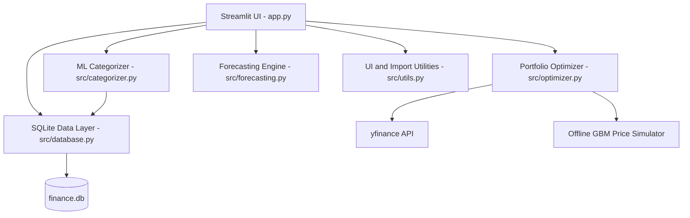

# OptimaWealth | Personal Wealth and Portfolio Intelligence

OptimaWealth is a resume-ready personal finance analytics application built with Streamlit, SQLite, scikit-learn, SciPy, Plotly, and yfinance. It combines expense tracking, ML transaction categorization, budget monitoring, portfolio optimization, risk modeling, stress testing, and net-worth forecasting in a single interactive dashboard.

The project is designed to demonstrate full-stack analytical product thinking: persistent data storage, CRUD workflows, import/export tooling, machine learning, quantitative finance, visual analytics, automated tests, Docker support, and CI.

## Highlights

- Transaction CRUD with manual entry, CSV bank-statement import, credit-card PDF parsing, filtering, editing, and deletion.
- ML auto-categorization using TF-IDF features and Logistic Regression, backed by a SQLite feedback loop for user corrections.
- Demo workspace seeding so the app opens as a complete product during interviews or portfolio demos.
- Budget tracking with month-to-date spend, percentage usage, and visual overage signals.
- Portfolio holdings CRUD with current valuation, allocation charts, and offline-safe synthetic pricing fallback.
- Modern Portfolio Theory optimizer using SciPy SLSQP for maximum Sharpe and minimum-volatility portfolios.
- Risk analytics covering parametric VaR, historical VaR, Conditional VaR / Expected Shortfall, Monte Carlo projections, and macro stress scenarios.
- Time-series forecasting for monthly expenses and net worth using regression-based models and uncertainty bands.
- Profile export and restore as JSON, plus a downloadable CSV import template.
- Test suite with mocked network behavior for reliable local and CI runs.

## Demo Flow

1. Run the app.
2. Click `Load Demo Workspace` in the sidebar or empty-state panel.
3. Review the Financial Health Command Center, budget tracker, transaction anomalies, optimizer, risk metrics, stress tests, and forecasting views.
4. Export the JSON profile, clear the workspace, and restore the backup to demonstrate complete data lifecycle support.

## Tech Stack

- Python
- Streamlit
- SQLite
- pandas and NumPy
- scikit-learn
- SciPy
- Plotly
- yfinance
- pypdf
- pytest
- Docker and GitHub Actions

## Architecture



## Project Structure

```text
finance/
├── app.py
├── requirements.txt
├── Dockerfile
├── docker-compose.yml
├── README.md
├── .github/workflows/pytest.yml
├── src/
│   ├── database.py
│   ├── categorizer.py
│   ├── optimizer.py
│   ├── forecasting.py
│   ├── utils.py
│   └── nse_stocks.csv
└── tests/
    └── test_finance.py
```

## Running Locally

```bash
python -m venv .venv
.venv\Scripts\activate
pip install -r requirements.txt
streamlit run app.py
```

Open `http://localhost:8501`.

## Running Tests

```bash
python -m pytest
```

The tests cover database initialization, transaction CRUD, profile restore, demo seeding, ML categorization, forecasting, anomaly detection, portfolio optimization, risk metrics, Monte Carlo simulation, CSV currency parsing, yfinance mocking, and credit-card PDF parsing.

## Docker

```bash
docker-compose up --build
```

Then open `http://localhost:8501`.

## Resume Bullets

- Built an end-to-end personal finance analytics dashboard with Streamlit, SQLite, Plotly, and Python, including transaction CRUD, CSV/PDF import, profile backup/restore, and Dockerized deployment.
- Implemented ML transaction categorization with TF-IDF and Logistic Regression, including a user-feedback loop that retrains from corrected categories stored in SQLite.
- Developed quantitative portfolio analytics using SciPy optimization, Value at Risk, Expected Shortfall, Monte Carlo simulation, and macro stress testing.
- Added regression-based cashflow and net-worth forecasting with uncertainty bands, plus automated pytest coverage and CI-ready mocked market-data tests.
